# Epistemic Topology → State Diagram & Transitions (Prime Directive Critique)

This document distills the conversation into a concrete **state system** and **transition calculus** suitable for design, policy, and simulation work. It integrates:

- Rumsfeld awareness classes (KK/KU/UK/UU)
- Foundation (Foundational vs. Abstract)
- **Bi-axial reducibility** (Individual vs. Group)
- Culpability/obligation rules (including UU non-culpability)
- The **catalyst/essentials/representatives/population** governance model
- **Biome sovereignty** (system-level ethical patient)
- Non-gameable constraints (irreversibility asymmetry)

---

## 1) Axes & Notation

**Epistemic Knots (core developmental axis):**
A knot is a self-sustaining recursive integration of harm-avoidance and goal-seeking across a higher order of scale, abstraction, and feedback depth—extending into ethical and epistemic recursion.

Knots are NOT linear stages. They are recursive closures of feedback loops that can be partial, overlapping, scaffolded, fused, or deepened. Each knot represents a minimum closure required to safely and coherently integrate a class of knowledge.

Canonical knot progression (not strictly ordered, but increasing recursive depth):
- **K0:** Reactive survival (harm-only)
- **K1:** Goal pursuit (goal-only)
- **K2:** Strategic planning (time-recursive harm-goal)
- **K3:** Systemic reasoning (multi-agent feedback)
- **K4:** Ethical systems (justice across agents)
- **K5:** Meta-ethics (reflective comparison of ethics)
- **K6:** Ecological/civilizational ethics (planetary-scale feedback)
- **K7:** Intercivilizational/game-theoretic ethics (iterated survival obligations)
- **K8:** Epistemic-topological ethics (culpability from knowledge states)
- **K9+:** Meta-ontological/cosmic/prime-based recursion

**Knowledge transfer rule:** A knowledge or technology object is tagged with the minimal knot required to integrate it. Ethical transfer requires the receiver to possess that knot or be scaffolded into it first.

**Stages of Epistemic Maturity (replaced by Knots):**
Rather than linear stages, SEM is now interpreted as the breadth and depth of knot integration.
** A knowledge object or technology is tagged with a minimal SEM required to safely use it. Ethical transfer requires Receiver_SEM ≥ Knowledge_SEM or scaffolding to raise SEM first.

**Awareness (A):**
- **KK** – Known Known (content + that-it-exists are known)
- **KU** – Known Unknown (we know *that* we don’t know the content)
- **UK** – Unknown Known (tacit/implicit/forgotten content exists but is not recognized)
- **UU** – Unknown Unknown (neither the content nor its existence is known)

**Foundation (FND):**
- **F** – Foundational/derivable from shared axioms
- **A** – Abstract/derivative/contingent (not yet reduced to axioms)

**Reducibility (RED):** *(bi-axial)*
- **Rᵢ / Iᵢ** – Individual reducible / irreducible (parts → whole)
- **R𝗀 / I𝗀** – Group reducible / irreducible (whole → emergent properties)

> **State Encoding:**  
> **A.FND.[Rᵢ|Iᵢ, R𝗀|I𝗀]**  
> Examples: `KK.F.[Rᵢ,I𝗀]`, `KU.A.[Rᵢ,R𝗀]`, `UK.F.[Iᵢ,R𝗀]`.

**Undefined tags:** For **UU**, FND/RED are usually **undefined** (we lack the proposition itself). For **UK**, FND/RED may be tagged when reconstructable (e.g., via audit/elicitation).

---

## 2) Canonical State Families

### 2.1 Knowledge-Present (operationally actionable)
- **KK.F.[…]** – Known, reduced to shared axioms (highest epistemic legitimacy)
- **KK.A.[…]** – Known, but still abstract (needs reduction to F)
- **KU.F.[…]** – We know a gap and its foundations (can target discovery)
- **KU.A.[…]** – We know a gap but not its foundations

### 2.2 Knowledge-Latent / Absent
- **UK.[…]** – Tacit/implicit knowledge; can be surfaced (e.g., via debrief, ethnography)
- **UU** – Fully unsuspected space; discovery transforms ethics and strategy

> **Design note:** In workflows, favor **KK.F.[…]** targets for binding policy; treat **KK.A.[…]** as provisional; treat **KU/UK** as queues for conversion; treat **UU** as risk requiring scouts/sensing.

---

## 3) Reducibility Matrix (semantic load of properties)

| Class | Individual (Rᵢ / Iᵢ) | Group (R𝗀 / I𝗀) | Typical Reading |
|---|---|---|---|
| **Rᵢ R𝗀** | Decomposable to parts; and collective is explainable from parts | Classical mechanics, counts, simple aggregates |
| **Rᵢ I𝗀** | Decomposable to parts; but collective shows **emergent** properties not reducible to parts | Language, markets, cultures, **biomes**, **civilizations** |
| **Iᵢ R𝗀** | Unit is irreducible at its scale; but collectives are explainable | Persons (as agents), fundamental components |
| **Iᵢ I𝗀** | Irreducible both ways | Axioms, logical laws, critical-phase phenomena |

> **Key ethical insight:** **Biomes** and **civilizations** typically classify as **Rᵢ I𝗀** (mechanistically analyzable, but possessing emergent, non-reducible group properties). This grounds **biome sovereignty** over contained civilizations in extinction scenarios.

---

## 4) High-Level Awareness Transitions

**Trigger classes:**
- **Sensing** (scouting, anomaly detection) promotes **UU→KU**.
- **Inquiry/Measurement** resolves **KU→KK**.
- **Elicitation** (ethnography, retros) surfaces **UK→KK**.
- **Decay/Forgetting** can send **KK→UK**.

---

## 5) Property-Refining Transitions (within KK/KU/UK)

```mermaid
flowchart TB
  subgraph Within-K/KU/UK
    A1[.A → .F]:::good --> A2
    R1[[Rᵢ,R𝗀 ↔ Rᵢ,I𝗀]]
    R2[[Rᵢ,R𝗀 ↔ Iᵢ,R𝗀]]
    R3[[Rᵢ,I𝗀 ↔ Iᵢ,I𝗀]]
  end
  classDef good fill:#e7f7ec,stroke:#1a7f37
```

- **Abstract→Foundational**: reduction to shared axioms (legitimacy ↑).  
- **Reducibility changes** reflect newly discovered emergence, unit irreducibility, or successful decomposition.

---

## 6) Ethical Calculus & Guardrails

### 6.1 Culpability Principle (load-bearing)
- **No culpability for failures in another’s UU**. If **you** hold `KK.F.[…]` that resolves **their UU/KU**, **non-intervention** in survival-critical contexts is ethically incoherent.

### 6.2 Irreversibility Asymmetry (non‑gameable rule)
- Representatives **cannot** choose **irreversible** losses for a population in **UU/UK** (e.g., extinction, permanent ignorance).  
- They **can** choose reversible implementations (methods, pacing) that are later reviewable.

### 6.3 Biome Sovereignty
- Because biomes are **Rᵢ I𝗀** with higher aggregate complexity, **civilizations may not vote to destroy their biomes**.  
- The **catalyst** may override civilizational preferences to preserve biome survival; post-crisis, all local choices become revisable **except** the past.

### 6.4 Partition Reification Error (don’t do this)
- Treating knowledge partitions (pre/post-warp; informed/uninformed) as different **kinds of beings** is a category mistake. Partitions are **transitions**, not ontologies.

---

## 7) Roles & Authority (temporal, with knot alignment and safeguards)

**Catalyst (KK.F + Knot 8+):**
- Detects existential threat.
- Must perform epistemic self-audit:
  - Map own KK/KU/UK on threat.
  - Identify all KU pockets.
  - Provide reduction path (KK.A→KK.F).
- Must publish pre-specified finish-line criteria:
  - Measurable, falsifiable.
  - Reviewed by Representatives.
- Authority expires at finish-line.

**Essentials (domain-specific knot holders):**
- Provide non-substitutable expertise.
- Must prove necessity (burden of proof).
- Subject to Representative challenge.

**Representatives (culturally grounded, knot-aligned):**
Binding powers:
- Veto specific implementations (not survival).
- Demand alternatives.
- Enforce cultural red lines (if survival-compatible).
- Challenge essentials lacking proof.
- Document dissent (binding in post-crisis accountability).
- Trigger review of Catalyst’s KK/F claims.
Cannot:
- Veto survival.
- Delay past irreversibility threshold.

**Population:**
- Temporarily UU/UK.
- Must be reunified to KK post-crisis.
- Full sovereignty restored.

---

## 8) Decision Authority by Property Class

| Property Class | Who Decides (during crisis) | Why |
|---|---|---|
| **Iᵢ I𝗀** (axioms/laws) | No one (constraints) | Non-negotiable |
| **I𝗀** (biome survival) | **Catalyst/Essentials** | Emergent sovereignty of containing system |
| **Rᵢ I𝗀** (culture/language/markets) | Reps constrain methods; Essentials implement | Emergent but decomposable → minimize disruption |
| **Iᵢ R𝗀** (individual autonomy) | Preserve unless conflicts with I𝗀 survival | Foundational unit; bounded by containing system survival |
| **Rᵢ R𝗀** (aesthetics, logistics) | Representatives | Fully reducible → democratic mechanisms OK |

---

## 9) Transition Rules (formal sketch)

Let **S = (A, FND, Rᵢ, R𝗀)**.

**Awareness transitions** (total order prefers higher awareness):
1. `UU → KU` (sensing)  
2. `KU → KK` (resolution)  
3. `UK → KK` (elicitation)  
4. `KK → KU` (scope exposure) / `KK → UK` (decay) [exception, avoid by governance]

**Foundation transitions** (legitimacy):
- `.A → .F` when reduction to shared axioms is provided (proof, derivation, or isomorphism to accepted foundations).

**Reducibility transitions** (discovery of structure):
- `Rᵢ R𝗀 ↔ Rᵢ I𝗀` (emergence at scale appears/disappears)  
- `Rᵢ R𝗀 ↔ Iᵢ R𝗀` (unit irreducibility appears/disappears)  
- `Rᵢ I𝗀 ↔ Iᵢ I𝗀` (both-way irreducibility at criticality)  

**Ethical triggers:**
- If *you* hold `KK.F` that resolves *their* `UU/KU` **and** the property in play is **I𝗀** (e.g., survival): **mandatory intervention**.  
- Post-finish-line: enforce **reunification** (`A → KK`) and shift policy legitimation to **KK.F** states only.

---

## 10) Governance Patterns

**Overselected election → feedback forum**
- Build a **diverse** candidate pool (prevents inference of hidden threat).  
- Representatives gain **KK.F** on the threat; they can challenge false "essentials" and shape culturally minimal implementations.

**Records & Accountability**
- Maintain tamper-evident logs of: threat proof, alternatives considered, necessity proofs for appointments, method constraints, harms mitigations.  
- Post-reunification public audit (retroactive judgment) is part of justice.

---

## 11) Anti-Gameability Checklist

- **Irreversibility Rule:** No irreversible losses chosen from **UU/UK**.
- **Minimality:** Appoint only true essentials (prove non-substitutability).
- **Temporal Bound:** Catalyst authority **expires** at survival.
- **Reunification:** Full population transition to **KK** is mandatory.
- **Emergence Respect:** Don’t dissolve **I𝗀** properties via **R𝗀** mechanisms (no voting away biomes).

### 11.1 Threat Origin Transparency
- Catalyst must prove threat is exogenous or not self-created.
- Disclose all prior knowledge of threat development.
- If Catalyst had >10% belief of the threat for >1 year without disclosure → authority nullified.
- Post-crisis audit: If Catalyst contributed >30% causally to the threat → penalties.
- Representatives can demand independent threat verification and external assessment.

